# UML Diagrams & Use Cases - Event Booking System

This document contains UML diagrams and use case descriptions for the Event & Wedding Booking System (Munasabati).

---

## Table of Contents

1. [Actor Definitions](#actor-definitions)
2. [Consumer Use Cases](#consumer-use-cases)
3. [Provider Use Cases](#provider-use-cases)
4. [Admin Use Cases](#admin-use-cases)
5. [Sequence Diagrams](#sequence-diagrams)
6. [Class Diagram](#class-diagram)
7. [Activity Diagrams](#activity-diagrams)

---

## Actor Definitions

| Actor | Description |
|-------|-------------|
| **Consumer** | End user who books services for events (weddings, birthdays, corporate events) |
| **Provider** | Service provider offering halls, cars, photography, or entertainment services |
| **Admin** | System administrator managing users, providers, and platform settings |
| **System** | Automated backend processes (notifications, payments, availability checks) |

---

## Consumer Use Cases

### Use Case Diagram

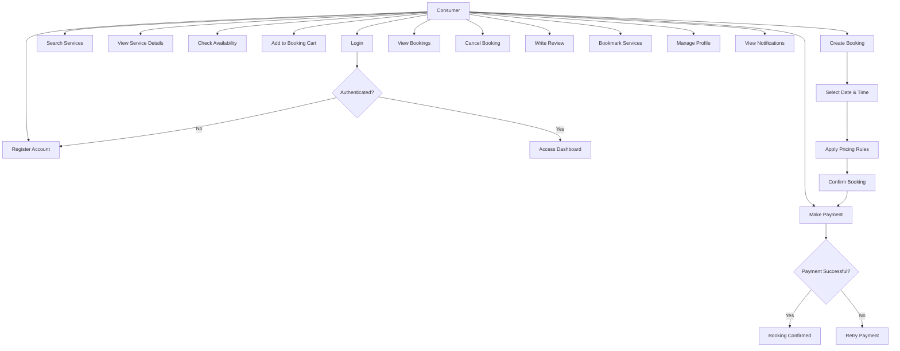

### Detailed Consumer Use Cases

#### UC-01: Register Account
**Actor:** Consumer  
**Description:** New user creates an account to access the platform  
**Preconditions:** None  
**Postconditions:** User account created, verification email sent  

**Main Flow:**
1. Consumer clicks "Sign Up" button
2. Consumer enters email, password, full name, phone number
3. Consumer agrees to Terms & Conditions
4. System validates input (email format, password strength)
5. System creates user account
6. System sends verification email
7. Consumer verifies email
8. Account activated

**Alternative Flows:**
- 4a. Email already exists → System displays error message
- 4b. Password too weak → System prompts for stronger password

---

#### UC-02: Login
**Actor:** Consumer  
**Description:** Existing user authenticates to access their account  
**Preconditions:** User account exists and is active  
**Postconditions:** User authenticated, JWT token issued  

**Main Flow:**
1. Consumer enters email and password
2. System validates credentials
3. System generates JWT access token
4. System stores refresh token securely
5. User redirected to dashboard

**Alternative Flows:**
- 2a. Invalid credentials → System displays error
- 2a. Account not verified → System prompts for verification

---

#### UC-03: Search Services
**Actor:** Consumer  
**Description:** Consumer searches for available services  
**Preconditions:** User authenticated  
**Postconditions:** List of matching services displayed  

**Main Flow:**
1. Consumer selects service type (Hall, Car, Photographer, Entertainer)
2. Consumer applies filters (price range, city, rating, date)
3. Consumer enters search keywords (optional)
4. System queries database
5. System displays filtered results with pagination

**Alternative Flows:**
- 5a. No results found → System displays "No services found" message
- 5a. Network error → System displays error with retry option

---

#### UC-04: View Service Details
**Actor:** Consumer  
**Description:** Consumer views detailed information about a service  
**Preconditions:** Service exists  
**Postconditions:** Service details displayed  

**Main Flow:**
1. Consumer clicks on a service from search results
2. System retrieves service details
3. System displays:
   - Service images/gallery
   - Description and features
   - Pricing information
   - Reviews and ratings
   - Availability calendar
   - Provider information

---

#### UC-05: Check Availability
**Actor:** Consumer  
**Description:** Consumer checks available time slots for a service  
**Preconditions:** Service selected  
**Postconditions:** Available slots displayed  

**Main Flow:**
1. Consumer selects date from calendar
2. System queries booked_slots table
3. System queries availability_templates
4. System calculates available slots
5. System displays available time slots

**Alternative Flows:**
- 5a. No slots available → System suggests nearby dates

---

#### UC-06: Create Booking
**Actor:** Consumer  
**Description:** Consumer creates a new booking with one or more services  
**Preconditions:** User authenticated, services selected  
**Postconditions:** Booking created in pending status  

**Main Flow:**
1. Consumer adds service to booking cart
2. Consumer selects event type (wedding, birthday, corporate)
3. Consumer selects event date
4. Consumer selects time slots for each service
5. System checks for conflicts
6. System applies dynamic pricing rules
7. Consumer enters special requests (optional)
8. Consumer reviews booking summary
9. Consumer confirms booking
10. System creates booking record
11. System locks slots in Redis (10-minute TTL)
12. Consumer redirected to payment

**Alternative Flows:**
- 6a. Conflict detected → System displays conflict message
- 6a. Slot already locked → System suggests alternative slot

---

#### UC-07: Make Payment
**Actor:** Consumer  
**Description:** Consumer pays for booking using Stripe  
**Preconditions:** Booking created, slots locked  
**Postconditions:** Payment processed, booking confirmed  

**Main Flow:**
1. Consumer selects payment method (card, bank transfer)
2. Consumer enters payment details
3. System creates Stripe PaymentIntent
4. Consumer confirms payment
5. Stripe processes payment
6. System receives webhook confirmation
7. System updates booking status to "confirmed"
8. System confirms booked_slots in database
9. System releases Redis lock
10. System sends confirmation email
11. System sends push notification to provider
12. System sends confirmation to consumer

**Alternative Flows:**
- 6a. Payment failed → System releases lock, displays error
- 6a. Payment timeout → System releases lock, displays timeout message

---

#### UC-08: View Bookings
**Actor:** Consumer  
**Description:** Consumer views all their bookings  
**Preconditions:** User authenticated  
**Postconditions:** List of bookings displayed  

**Main Flow:**
1. Consumer navigates to "My Bookings"
2. System retrieves user's bookings
3. System filters by status (pending, confirmed, completed, cancelled)
4. System displays booking cards with:
   - Service details
   - Date and time
   - Status
   - Total amount
   - Actions (cancel, view details)

---

#### UC-09: Cancel Booking
**Actor:** Consumer  
**Description:** Consumer cancels a booking  
**Preconditions:** Booking exists, not in progress/completed  
**Postconditions:** Booking cancelled, slots released  

**Main Flow:**
1. Consumer selects booking to cancel
2. System displays cancellation policy
3. Consumer confirms cancellation
4. System updates booking status to "cancelled"
5. System releases booked_slots
6. System processes refund (if applicable)
7. System sends cancellation email
8. System notifies provider

**Alternative Flows:**
- 3a. Cancellation not allowed (too close to event) → System displays policy

---

#### UC-10: Write Review
**Actor:** Consumer  
**Description:** Consumer writes a review for a completed booking  
**Preconditions:** Booking completed, not yet reviewed  
**Postconditions:** Review saved, provider rating updated  

**Main Flow:**
1. Consumer selects completed booking
2. Consumer selects rating (1-5 stars)
3. Consumer writes review text (optional)
4. Consumer uploads images (optional)
5. System saves review
6. System updates provider rating
7. System notifies provider

---

#### UC-11: Bookmark Services
**Actor:** Consumer  
**Description:** Consumer saves services for later reference  
**Preconditions:** User authenticated  
**Postconditions:** Service bookmarked  

**Main Flow:**
1. Consumer clicks "Bookmark" on service
2. System adds service to user's bookmarks
3. System displays "Bookmarked" indicator

**Alternative Flows:**
- 2a. Already bookmarked → System removes bookmark

---

#### UC-12: Manage Profile
**Actor:** Consumer  
**Description:** Consumer updates their profile information  
**Preconditions:** User authenticated  
**Postconditions:** Profile updated  

**Main Flow:**
1. Consumer navigates to Profile
2. Consumer edits:
   - Full name
   - Phone number
   - Avatar image
   - Preferences
3. Consumer saves changes
4. System updates user record
5. System displays success message

---

## Provider Use Cases

### Use Case Diagram

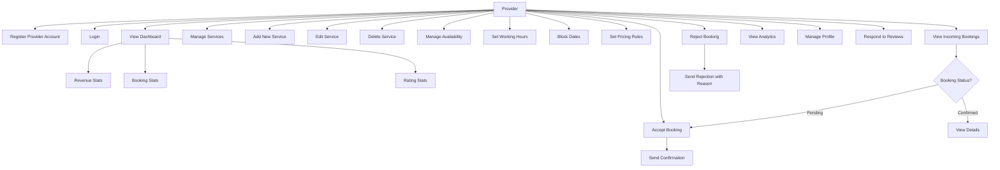

### Detailed Provider Use Cases

#### UC-P01: Register Provider Account
**Actor:** Provider  
**Description:** Service provider creates a business account  
**Preconditions:** User account exists  
**Postconditions:** Provider profile created, pending verification  

**Main Flow:**
1. Provider navigates to "Become a Provider"
2. Provider enters business information:
   - Business name
   - Service type (Hall, Car, Photographer, Entertainer)
   - Description
   - Contact details
   - Address/location
3. Provider uploads business documents
4. Provider uploads logo and cover image
5. System creates provider profile
6. System sets status to "pending verification"
7. System notifies admin for verification

---

#### UC-P02: View Dashboard
**Actor:** Provider  
**Description:** Provider views analytics and overview  
**Preconditions:** Provider authenticated  
**Postconditions:** Dashboard displayed  

**Main Flow:**
1. Provider navigates to Dashboard
2. System retrieves provider data
3. System displays:
   - Total revenue (current month, year)
   - Number of bookings (by status)
   - Average rating
   - Upcoming bookings
   - Pending requests
   - Revenue charts
   - Booking trends

---

#### UC-P03: Manage Services
**Actor:** Provider  
**Description:** Provider manages their service listings  
**Preconditions:** Provider authenticated  
**Postconditions:** Service list displayed  

**Main Flow:**
1. Provider navigates to "My Services"
2. System retrieves provider's services
3. System displays service cards with:
   - Service name
   - Price
   - Status (active/inactive)
   - Number of bookings
   - Average rating
   - Actions (edit, delete, toggle status)

---

#### UC-P04: Add New Service
**Actor:** Provider  
**Description:** Provider adds a new service listing  
**Preconditions:** Provider authenticated  
**Postconditions:** Service created  

**Main Flow:**
1. Provider clicks "Add Service"
2. Provider enters service details:
   - Title
   - Description
   - Base price
   - Pricing model (flat, hourly, per event)
   - Capacity (for halls)
   - Features/amenities
   - Images (multiple)
   - Tags
3. Provider uploads images
4. System validates input
5. System creates service record
6. System displays success message

---

#### UC-P05: Manage Availability
**Actor:** Provider  
**Description:** Provider sets available time slots  
**Preconditions:** Service exists  
**Postconditions:** Availability templates updated  

**Main Flow:**
1. Provider selects service
2. Provider navigates to "Availability"
3. Provider sets working hours for each day:
   - Start time
   - End time
   - Break times
4. Provider blocks specific dates (holidays, maintenance)
5. System saves availability templates
6. System updates available slots

---

#### UC-P06: Set Pricing Rules
**Actor:** Provider  
**Description:** Provider creates dynamic pricing rules  
**Preconditions:** Service exists  
**Postconditions:** Pricing rules saved  

**Main Flow:**
1. Provider selects service
2. Provider navigates to "Pricing"
3. Provider creates pricing rule:
   - Rule type (weekend, seasonal, peak, early bird)
   - Multiplier (e.g., 1.5x for weekends)
   - Date range
   - Days of week
4. System saves pricing rule
5. System applies rule to future bookings

---

#### UC-P07: View Incoming Bookings
**Actor:** Provider  
**Description:** Provider views booking requests  
**Preconditions:** Provider authenticated  
**Postconditions:** Booking list displayed  

**Main Flow:**
1. Provider navigates to "Bookings"
2. System retrieves incoming bookings
3. System displays bookings with:
   - Consumer information
   - Service requested
   - Date and time
   - Special requests
   - Status (pending, confirmed, rejected)
   - Actions (accept, reject)

---

#### UC-P08: Accept Booking
**Actor:** Provider  
**Description:** Provider accepts a booking request  
**Preconditions:** Booking in pending status  
**Postconditions:** Booking confirmed, consumer notified  

**Main Flow:**
1. Provider views pending booking
2. Provider clicks "Accept"
3. System updates booking status to "confirmed"
4. System confirms booked_slots
5. System sends confirmation email to consumer
6. System sends push notification to consumer
7. System adds to provider's calendar

---

#### UC-P09: Reject Booking
**Actor:** Provider  
**Description:** Provider rejects a booking request  
**Preconditions:** Booking in pending status  
**Postconditions:** Booking rejected, slots released  

**Main Flow:**
1. Provider views pending booking
2. Provider clicks "Reject"
3. Provider enters rejection reason
4. System updates booking status to "cancelled"
5. System releases booked_slots
6. System sends rejection email to consumer
7. System processes refund (if payment made)

---

#### UC-P10: View Analytics
**Actor:** Provider  
**Description:** Provider views detailed analytics  
**Preconditions:** Provider authenticated  
**Postconditions:** Analytics displayed  

**Main Flow:**
1. Provider navigates to "Analytics"
2. System retrieves booking data
3. System displays:
   - Revenue by month (chart)
   - Bookings by service type
   - Customer demographics
   - Peak booking times
   - Cancellation rate
   - Rating trends

---

#### UC-P11: Respond to Reviews
**Actor:** Provider  
**Description:** Provider responds to customer reviews  
**Preconditions:** Review exists  
**Postconditions:** Response saved  

**Main Flow:**
1. Provider views review
2. Provider clicks "Respond"
3. Provider writes response
4. System saves response
5. System notifies consumer

---

## Admin Use Cases

### Use Case Diagram

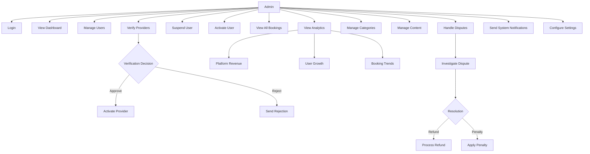

### Detailed Admin Use Cases

#### UC-A01: View Dashboard
**Actor:** Admin  
**Description:** Admin views platform-wide statistics  
**Preconditions:** Admin authenticated  
**Postconditions:** Dashboard displayed  

**Main Flow:**
1. Admin navigates to Dashboard
2. System retrieves platform data
3. System displays:
   - Total users
   - Total providers
   - Total bookings
   - Platform revenue
   - Active bookings
   - Pending provider verifications
   - Recent disputes
   - System health status

---

#### UC-A02: Verify Providers
**Actor:** Admin  
**Description:** Admin reviews and approves/rejects provider applications  
**Preconditions:** Provider in pending status  
**Postconditions:** Provider status updated  

**Main Flow:**
1. Admin navigates to "Provider Verifications"
2. Admin views pending applications
3. Admin reviews provider documents
4. Admin checks business information
5. Admin clicks "Approve" or "Reject"
6. If approved:
   - System sets provider status to "active"
   - System sends approval email
   - Provider can now accept bookings
7. If rejected:
   - Admin enters rejection reason
   - System sets provider status to "rejected"
   - System sends rejection email

---

#### UC-A03: Manage Users
**Actor:** Admin  
**Description:** Admin manages user accounts  
**Preconditions:** Admin authenticated  
**Postconditions:** User status updated  

**Main Flow:**
1. Admin navigates to "Users"
2. System displays user list with filters
3. Admin searches for specific user
4. Admin views user details:
   - Account information
   - Booking history
   - Payment history
   - Reports/flags
5. Admin performs actions:
   - Suspend account
   - Activate account
   - Delete account
   - Send warning
   - View activity log

---

#### UC-A04: View All Bookings
**Actor:** Admin  
**Description:** Admin views all platform bookings  
**Preconditions:** Admin authenticated  
**Postconditions:** Booking list displayed  

**Main Flow:**
1. Admin navigates to "All Bookings"
2. System retrieves all bookings
3. System applies filters (date range, status, provider, consumer)
4. System displays booking list with:
   - Booking ID
   - Consumer and provider info
   - Service details
   - Date and time
   - Amount
   - Status
   - Actions (view details, cancel, refund)

---

#### UC-A05: Handle Disputes
**Actor:** Admin  
**Description:** Admin resolves disputes between consumers and providers  
**Preconditions:** Dispute reported  
**Postconditions:** Dispute resolved  

**Main Flow:**
1. Admin navigates to "Disputes"
2. Admin views reported dispute
3. Admin reviews:
   - Booking details
   - Communication history
   - Evidence provided
   - Policies involved
4. Admin makes decision:
   - Refund to consumer
   - Partial refund
   - No action (uphold booking)
   - Apply penalty to provider
5. System executes decision
6. System notifies both parties
7. System updates dispute status to "resolved"

---

#### UC-A06: View Analytics
**Actor:** Admin  
**Description:** Admin views platform analytics  
**Preconditions:** Admin authenticated  
**Postconditions:** Analytics displayed  

**Main Flow:**
1. Admin navigates to "Analytics"
2. System retrieves platform data
3. System displays:
   - Revenue trends (monthly, yearly)
   - User growth chart
   - Booking volume by service type
   - Geographic distribution
   - Provider performance rankings
   - Consumer satisfaction metrics
   - Cancellation rates

---

#### UC-A07: Manage Categories
**Actor:** Admin  
**Description:** Admin manages service categories and tags  
**Preconditions:** Admin authenticated  
**Postconditions:** Categories updated  

**Main Flow:**
1. Admin navigates to "Categories"
2. System displays existing categories
3. Admin performs actions:
   - Add new category
   - Edit category name
   - Delete category
   - Add subcategories
   - Manage tags

---

#### UC-A08: Configure Settings
**Actor:** Admin  
**Description:** Admin configures platform settings  
**Preconditions:** Admin authenticated  
**Postconditions:** Settings updated  

**Main Flow:**
1. Admin navigates to "Settings"
2. Admin configures:
   - Platform fees (commission percentage)
   - Payment gateway settings
   - Email/SMS settings
   - Notification preferences
   - Security settings
   - API rate limits
3. Admin saves changes
4. System updates configuration

---

## Sequence Diagrams

### Sequence Diagram: Booking Flow

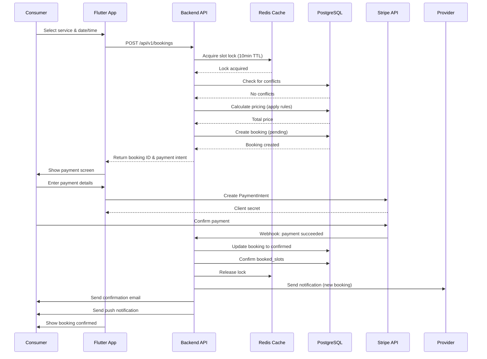

### Sequence Diagram: Provider Accepts Booking

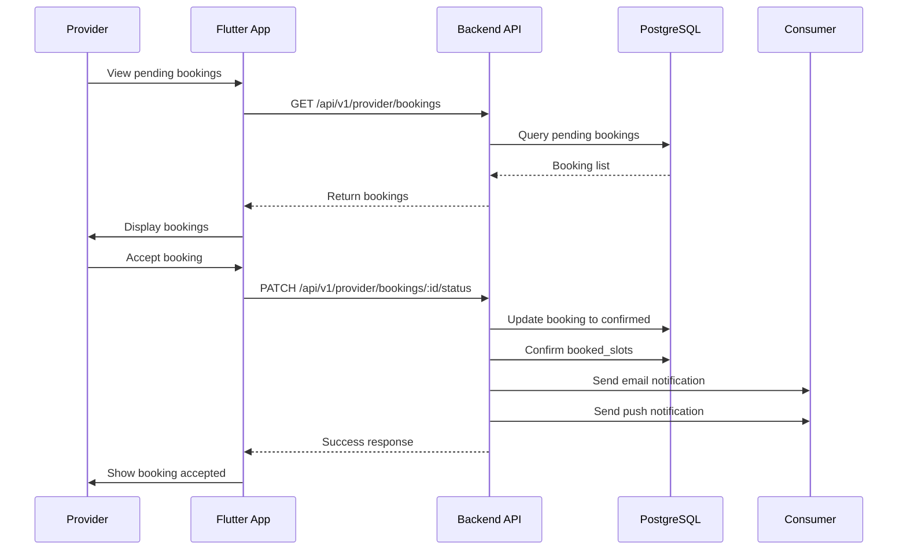

### Sequence Diagram: Authentication Flow

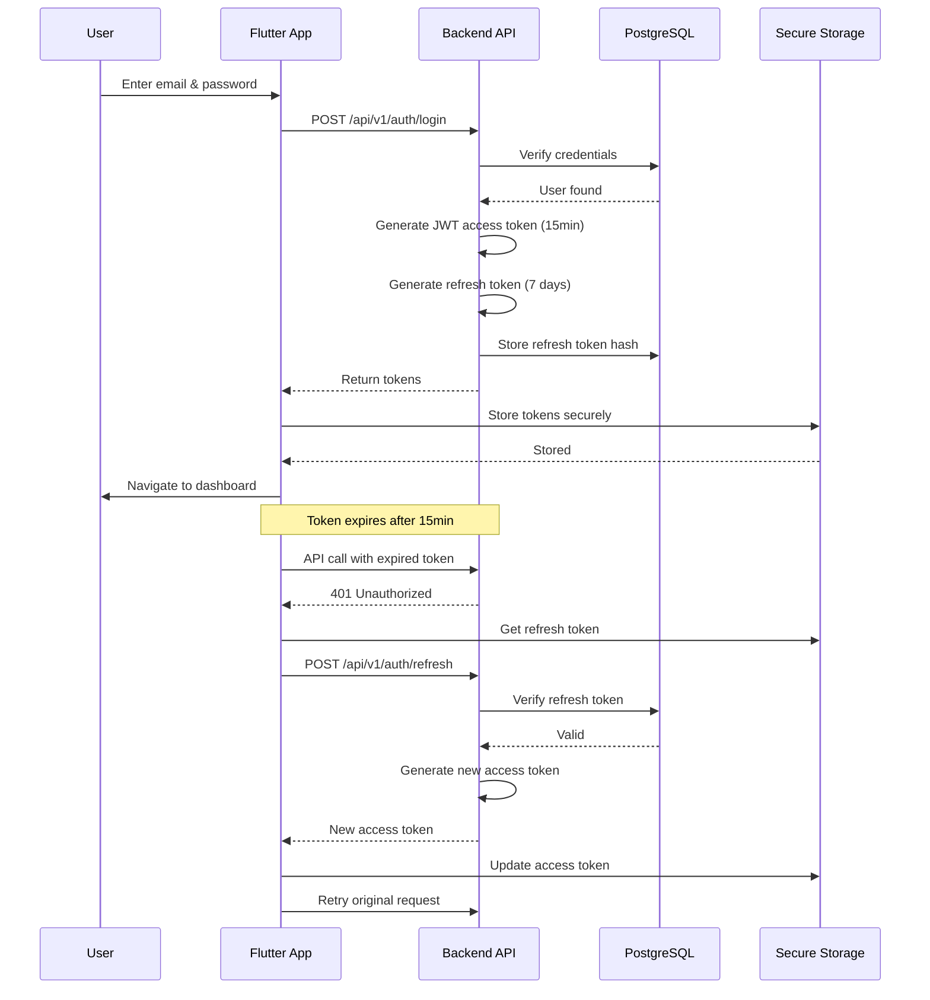

---

## Class Diagram

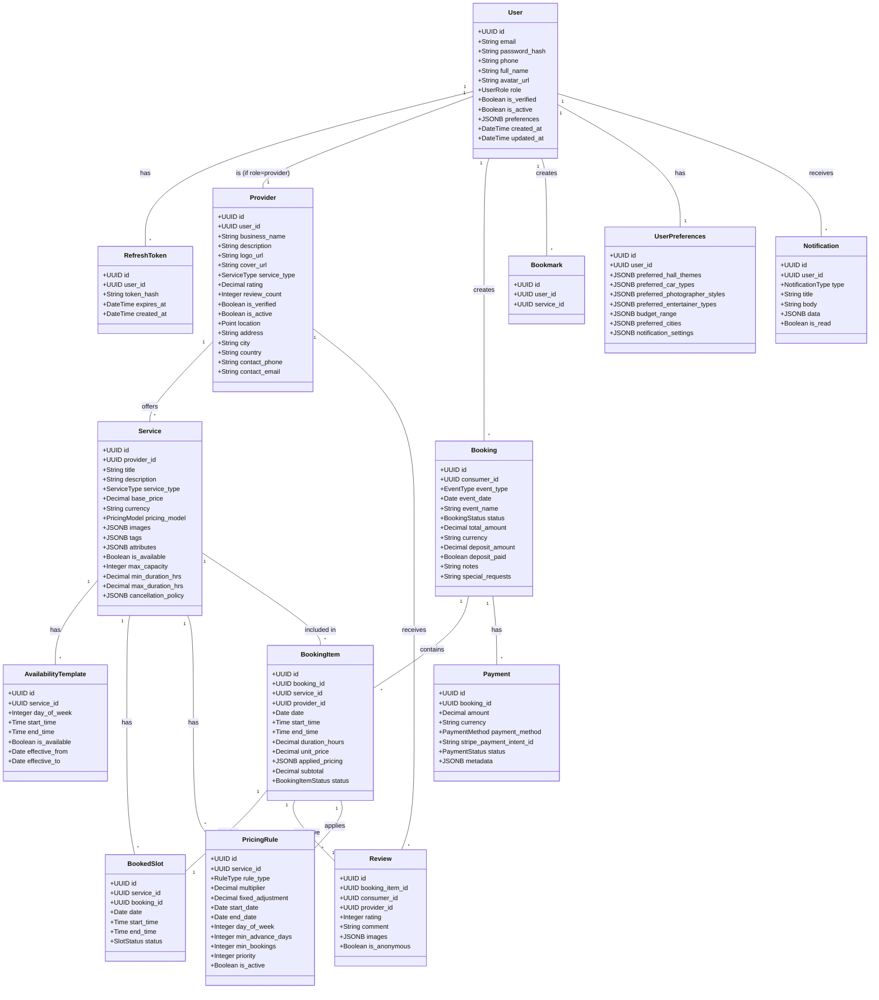

---

## Activity Diagrams

### Activity Diagram: Consumer Booking Process

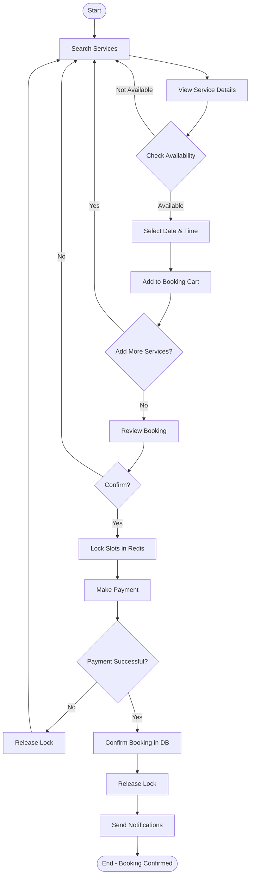

### Activity Diagram: Provider Onboarding

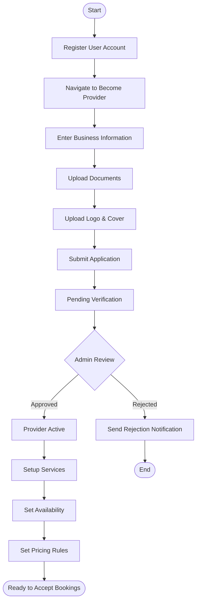

### Activity Diagram: Admin Dispute Resolution

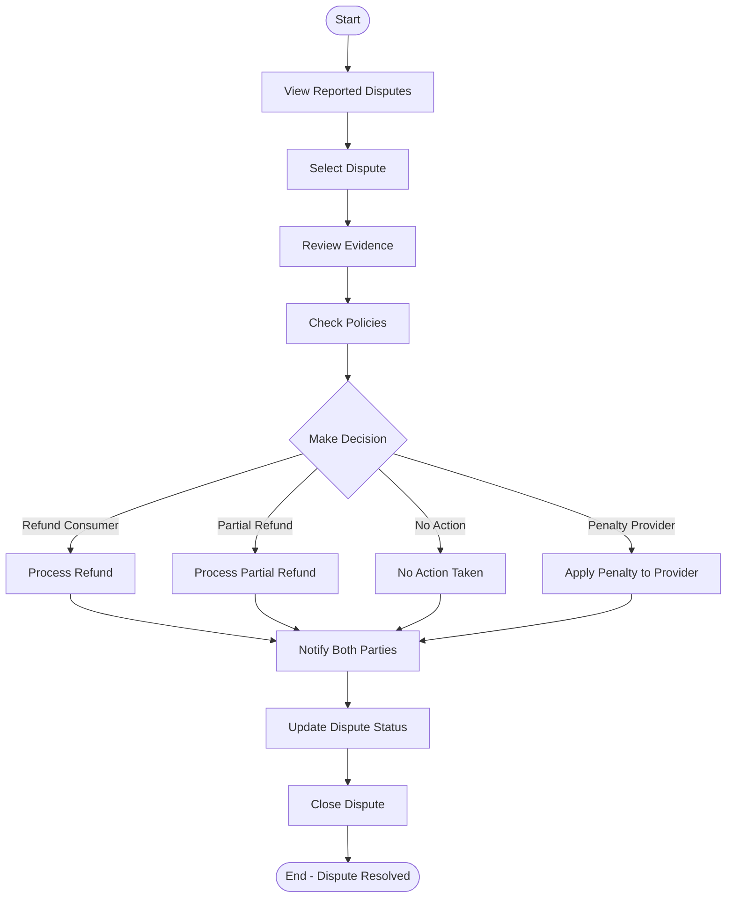

---

## Data Flow Diagrams

### Level 1 DFD: Consumer Booking

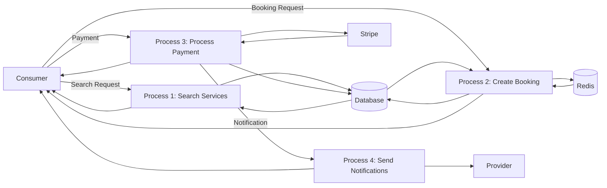

---

## State Diagrams

### State Diagram: Booking Lifecycle

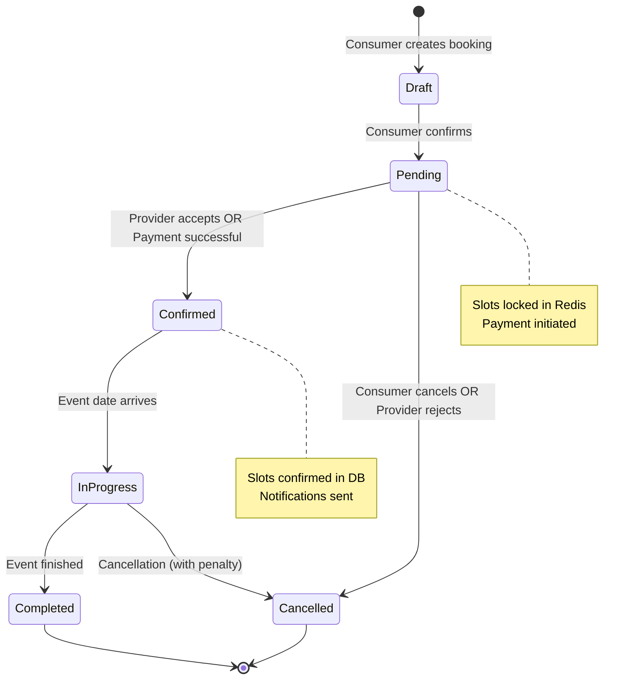

### State Diagram: Provider Verification

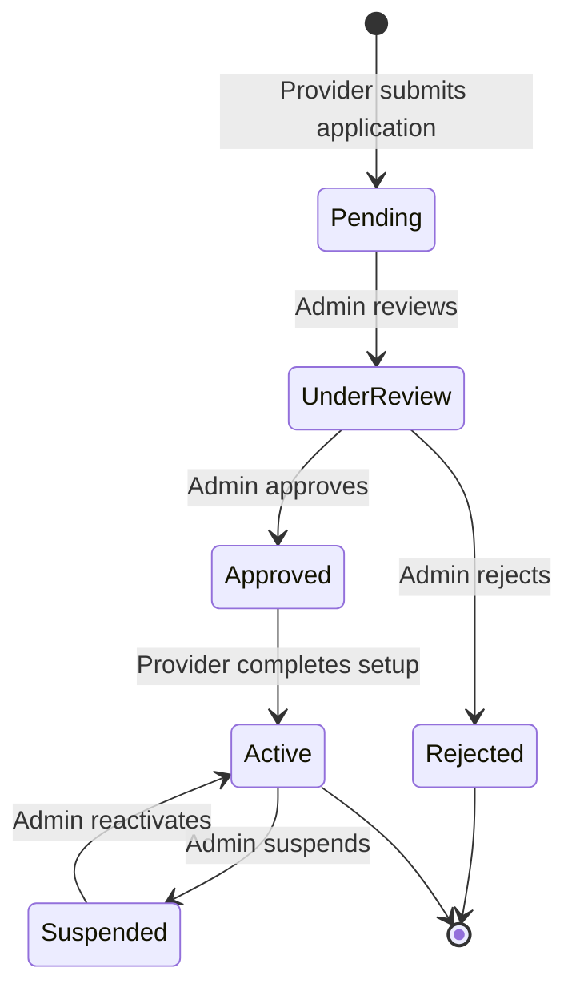

---

## Entity Relationship Diagram

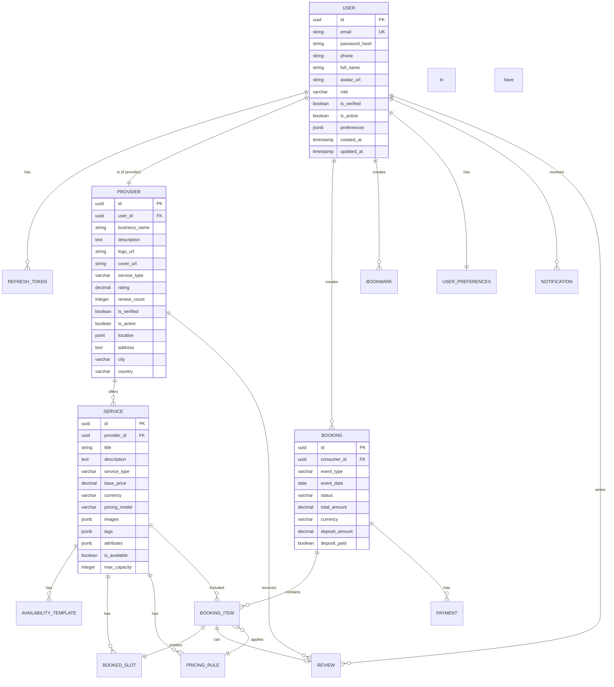

---

## Summary

This document provides comprehensive UML diagrams and use case documentation for the Event & Wedding Booking System. The system supports three main user types:

1. **Consumer** - End users who search, book, and pay for event services
2. **Provider** - Service providers who manage their offerings and accept bookings
3. **Admin** - Platform administrators who oversee operations and resolve disputes

The system uses a microservices-like architecture with:
- Flutter mobile app for consumers and providers
- Node.js backend with Fastify
- PostgreSQL for persistent data
- Redis for caching and slot locking
- Stripe for payment processing
- WebSocket for real-time notifications

All use cases include detailed flows, alternative paths, and error handling to ensure robust system behavior.
